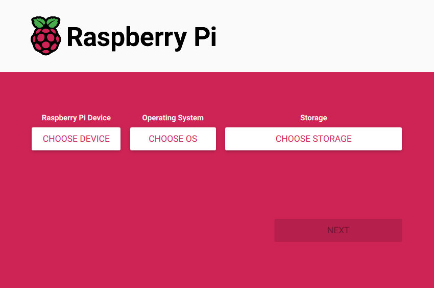
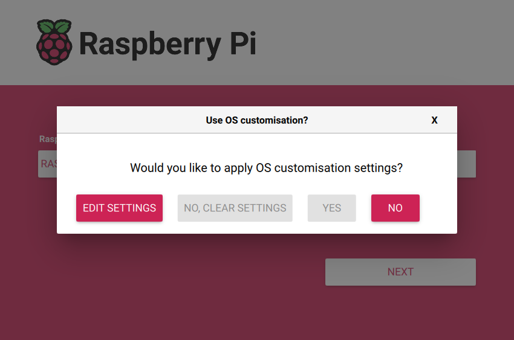
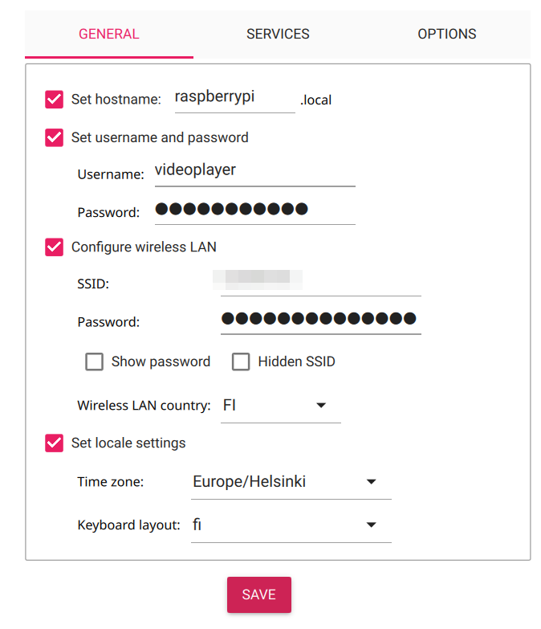
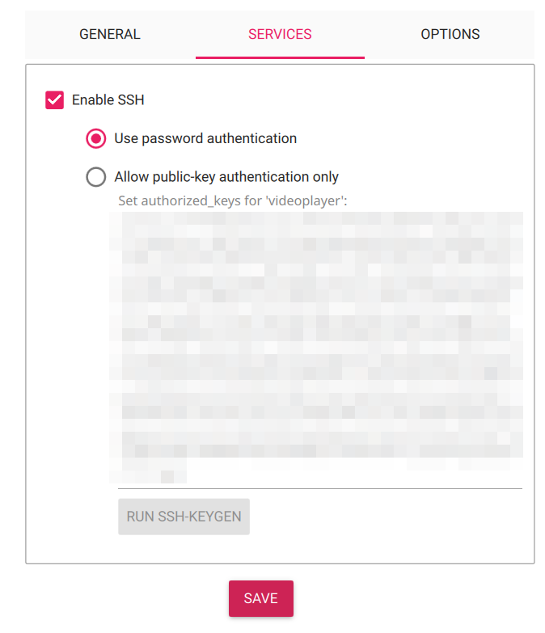
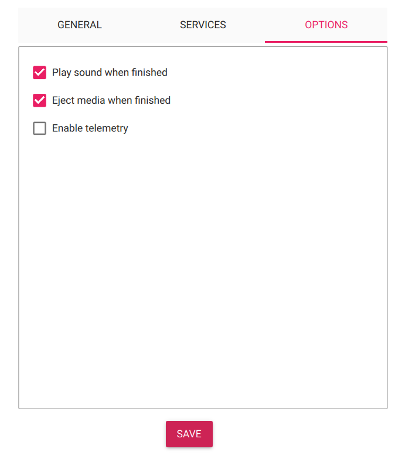
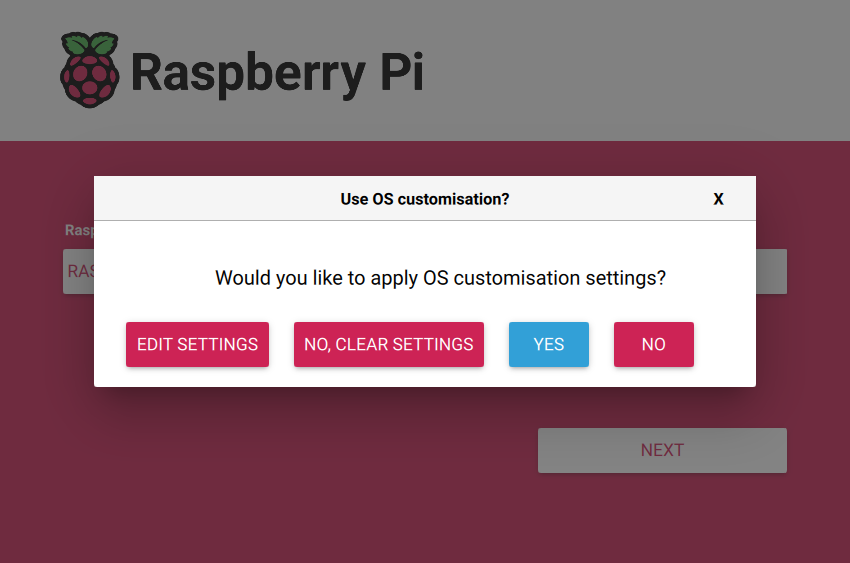
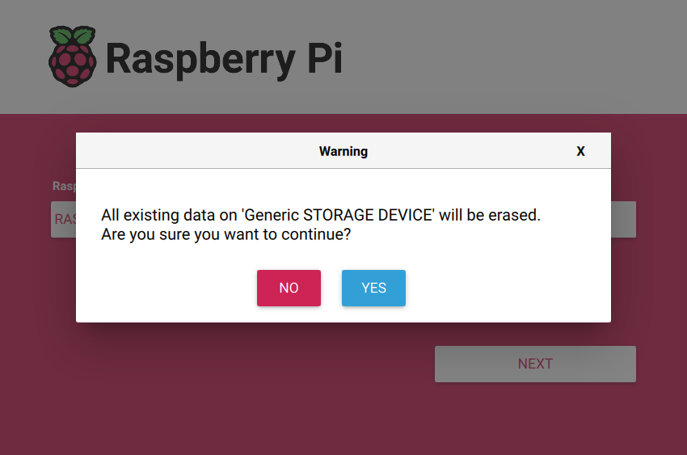
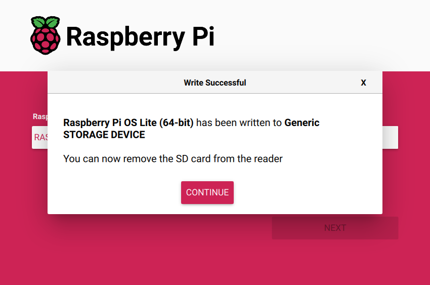

> [!CAUTION]  
> WIP = Work in progress! This warning will be removed after project's documentation is completed.

# video-display
  
  
Video display in use.  
  
Table of Contents
-----------------
  * [Objective](#objective)
  * [Hardware specifics](#hardware)
  * [Software used](#software)  
  * [Steps](#steps)
  * [01 Install RPI-Imager](#1-run-01-install-rpi-imagersh-script-to-install-and-start-raspberry-pi-imager)
  * [02 Choose correct options for your device](#2-use-drop-down-menus-for-choosing-correct-options-for-your-device)  
  * [03 Edit OS customisationsettings](#3-edit-os-customisation-settings)

## Objective

Automatic video display with SSH connection for configuration

Goal of this project is to create easy to use ***(switch on / switch off)*** low (or no) maintenance system for viewing videos at exhibition.    
  
This system is implemented on **`Raspberry Pi 4B (4 GB RAM)`** with **`Raspberry Pi OS Lite (Debian Linux 12)`** as operating system.  

## Functionality

1. Project **video-display** enables [`systemd service`](#create-a-service) (`playvideos.service`) when the device starts up.  
2. This service points to a [`bash script`](#Bash-script-for-looping-videos) that uses  
3.  [`VLC player`](https://www.videolan.org/vlc/) to play video files with `MP4` file extension in a loop from the  `/home/ubuntu/video` (or other user defined) folder. 


### Hardware
- [`Raspberry Pi 4B (4 GB RAM)`](https://www.raspberrypi.com/products/raspberry-pi-4-model-b/) with `3A power supply`  
- `64 GB microSD card`  
- `Micro HDMI - HDMI cable` for connecting  
- [`27" Lenovo thinkVision T27h-30`](https://support.lenovo.com/us/en/solutions/pd500590-thinkvision-t27h-30-monitor-overview) display for viewing the videos

### Steps

#### 1. Run [01-install-rpi-imager.sh](01-install-rpi-imager.sh) script to install and start [`Raspberry Pi Imager`](https://www.raspberrypi.com/software/)  
```sh
chmod +x ./01-install-rpi-imager.sh
```
If needed use `chmod` to make script executable and then run the script.
```sh
./01-install-rpi-imager.sh
```   



#### 2. Use drop down menus for choosing correct options for your device 
`Raspberry Pi Device` -->  **Raspberry Pi 4**  
`Operating System` -->  **Raspberry Pi OS (other) --> Raspberry Pi OS Lite (64-bit)**  
`Storage` --> **Choose your storage device and click *Next***  
  
  

#### 3. Edit OS customisation settings  

Choose `EDIT SETTINGS` --> `GENERAL` tab
   
  
- `Set hostname` to your preference. In this example the default **raspberrypi**.local is used.
- Also `Set username and password` to your preference.
- In this example we `Configure wireless LAN` and set up network's name `SSID` and `Password`. This is a step for accessing this server remotely in configuration phase. Set up also `Wireless LAN country` to comply with deployment country's regulatory domain.
- We'll `Set locale settings` to Finnish but you can choose according to your own preference.

Go to `SERVICES` tab  
     
- Choose `Enable SSH` and `Use password authentication`  

> [!CAUTION]  
> For better security it is recommended to use the `Allow public-key authentication only` option but **as this device won't be connected to any network when in running mode** we will be using the `Use password authentication` option.  



 On `OPTIONS`tab disable `Enable telemetery` and enable `Play sound when finished` and `Eject media when finished`.  



#### 4. Apply settings and create OS image on microSD card


Apply settings

  
Create OS image on microSD card

> [!NOTE]
> You might be asked for privileged user password at this point


After installer has verified a successfull write remove microsSD card safely using your operating system's dialog for this.

For example in many Linux GUI distros this can be done by choosing microSD card in `Disks` software left pane and then pressing `Eject this disk` icon from up.

#### 5. Insert ready microSD card to Raspberry Pi and start Pi

Insert ready microSD card to Raspberry Pi. When started Pi should automatically register to wireless network that was set up back in [step 3](#3-edit-os-customisation-settings).

#### 6. SSH connection to configure Pi
This step assumes you are on the same network with Raspberry Pi.


### Software  
- This system uses [`Raspberry Pi OS Lite (64-bit)`](https://www.raspberrypi.com/software/operating-systems/) as operating system.
- Bootable microSD for Raspi 4 is created with [`Raspberry Pi Imager`](https://www.raspberrypi.com/software/).
- [`VLC player`](https://www.videolan.org/vlc/) takes care of playing videos in loop.

#### Detailed information of Raspberry Pi OS  
```bash
cat /etc/os-release
```

```bash
PRETTY_NAME="Debian GNU/Linux 12 (bookworm)"
NAME="Debian GNU/Linux"
VERSION_ID="12"
VERSION="12 (bookworm)"
VERSION_CODENAME=bookworm
ID=debian
HOME_URL="https://www.debian.org/"
SUPPORT_URL="https://www.debian.org/support"
BUG_REPORT_URL="https://bugs.debian.org/"
```
The `hostnamectl` command gives also plenty of information. This information can be filtered by piping  `hostnamectl` command with `àwk` as in the example below.
```bash
hostnamectl | awk '
/Operating System:/ {print}
/Kernel:/ {print}
/Architecture:/ {print}'
```

```bash
Operating System: Debian GNU/Linux 12 (bookworm)
          Kernel: Linux 6.12.34+rpt-rpi-v8
    Architecture: arm64
```

### Pre-requisites script

```sh
#!/bin/bash

# Update package lists
echo "Checking available upgrades..."
sudo apt update > /dev/null 2>&1

# Check for upgradable packages
UPDATES=$(apt list --upgradable 2>/dev/null | grep -v Listing)

if [ -n "$UPDATES" ]; then
    echo "Upgrades available. Proceeding with upgrade..."
    # Upgrade packages
    sudo apt upgrade -y
else
    echo "No upgrades available."
fi

# Install VLC player.

sudo apt install vlc -y
```


#### Bash script for looping videos

```bash
nano videos-player.sh
```

```bash
#!/bin/bash

VIDEO_DIR=/home/ubuntu/video # Define directory for the videos

while true; do
    for video in "$VIDEO_DIR"/*.mp4; do
        if [ -f "$video" ]; then
            cvlc --no-video-title-show --play-and-exit "$video"
        fi
    done
done
```


### Service

#### Creation of a service
```bash
sudo nano /etc/systemd/system/playvideos.service
```

```bash
[Unit]
Description=Play Videos Loop

[Service]
ExecStart=/bin/bash /home/ubuntu/videos-player.sh
Restart=always
User=ubuntu

[Install]
WantedBy=multi-user.target
```

#### Enable service to start when the device is started
```bash
   sudo systemctl enable playvideos.service 
```

## Power consumption

System draws less than 26 watts maximum from the power outlet when playing `60 FPS` full HD `(1920 x 1080) resolution videos`. `CHECK THIS WITH DIFFERENT VIDEO FORMATS, RESOLUTON AND BITRATES!!!`
> [!IMPORTANT]  
> List details of video formats used HERE!
